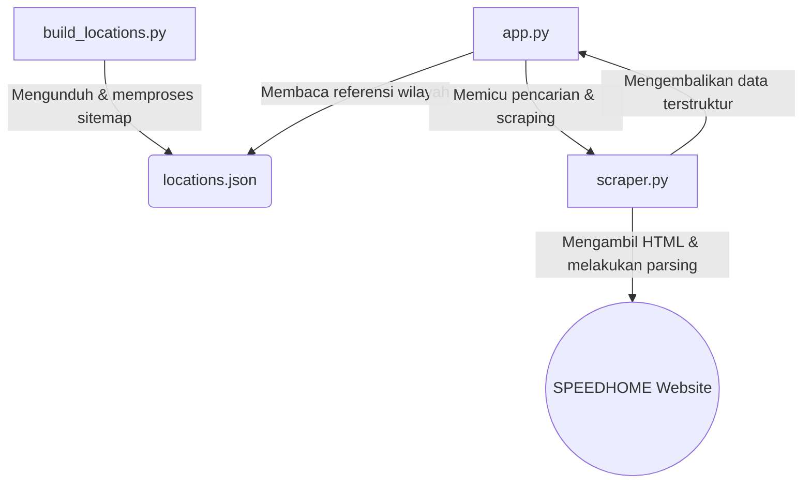

# Dokumentasi Kode: SPEEDHOME Price Intelligence

Berkas ini menyediakan dokumentasi teknis yang komprehensif bagi pengembang (developer) mengenai arsitektur kode, struktur file, fungsionalitas fungsi secara baris demi baris, dan alur integrasi antar file dalam aplikasi **SPEEDHOME Price Intelligence**.

---

## 1. Arsitektur & Peta Hubungan Berkas

Aplikasi ini menggunakan arsitektur modular yang memisahkan antara logika pengambilan data (web scraping), data referensi wilayah, pemeliharaan data, dan antarmuka pengguna (web interface).

### Daftar File Utama:
1.  **[scraper.py](file:///c:/gawe/Gawe/Jendela360/scraper.py)**: Berisi logika inti web scraper, pembersih data, normalisasi data properti, dan teknik melewati proteksi Cloudflare.
2.  **[app.py](file:///c:/gawe/Gawe/Jendela360/app.py)**: File utama aplikasi Streamlit yang menangani visualisasi data, interaksi UI, kalkulasi metrik finansial, dan algoritma penentuan skor perbandingan investasi.
3.  **[build_locations.py](file:///c:/gawe/Gawe/Jendela360/build_locations.py)**: Script utilitas pengumpul daftar wilayah otomatis dari sitemap XML resmi SPEEDHOME untuk memperbarui daftar autocomplete.

---

## 2. Dokumentasi Rinci File `.py`

### A. scraper.py (Core Web Scraper)
File ini bertanggung jawab penuh untuk mengunduh dokumen HTML dari SPEEDHOME dan mengekstrak data JSON terstruktur.

#### Fungsi & Baris Kode Penting:

1.  **`slugify(text)`** (Baris 7-18):
    *   *Kegunaan*: Membersihkan string teks input dari pengguna menjadi format slug URL (huruf kecil, membuang spasi ganda, dan mengganti spasi/karakter non-kata menjadi tanda hubung `-`).
    *   *Implementasi*: Menggunakan ekspresi reguler (`re.sub`).

2.  **`extract_slug_from_url(url)`** (Baris 20-40):
    *   *Kegunaan*: Mengekstrak nama slug wilayah serta nomor halaman jika pengguna memasukkan URL langsung (seperti `https://speedhome.com/rent/mont-kiara?page=2`).
    *   *Implementasi*: Menggunakan kecocokan regex terhadap pola URL sewa SPEEDHOME.

3.  **`normalize_furniture(furnish_type)`** (Baris 42-51):
    *   *Kegunaan*: Mengubah string mentah status perabotan dari website menjadi salah satu dari 3 kategori standar: `Fully Furnished`, `Partially Furnished`, atau `Unfurnished`.

4.  **`normalize_room_type(bedroom_count, type_str)`** (Baris 53-60):
    *   *Kegunaan*: Menghasilkan penamaan standar tipe kamar. Mengonversi tipe bertipe `"STUDIO"` atau `"ROOM"`, atau jika berbasis jumlah kamar tidur, diubah menjadi format `"1 BR"`, `"2 BR"`, dst.

5.  **`fetch_speedhome_page_source(url)`** (Baris 62-113):
    *   *Kegunaan*: Inti pertahanan bypass Cloudflare. Mengimplementasikan 3 lapis fallback:
        *   *Lapis 1*: Menggunakan `curl_cffi` dengan opsi impersonate browser Chrome untuk menyamakan sidik jari TLS.
        *   *Lapis 2*: Memanggil program CLI `curl` sistem secara asinkron menggunakan subproses Python untuk menyiasati batasan TLS Python bawaan.
        *   *Lapis 3*: Pustaka standard `requests` Python dengan penyesuaian header user-agent dasar.

6.  **`scrape_speedhome_listings(search_input, delay=1.0)`** (Baris 115-241):
    *   *Kegunaan*: Melakukan iterasi (looping) halaman demi halaman (pagination) mulai dari halaman pertama hingga habis atau dibatasi oleh halaman kosong.
    *   *Logika Deteksi Data*: Mengurai elemen script `<script type="application/ld+json">` yang berisikan struktur data JSON-LD skema `ItemList` dari SPEEDHOME. Jika script JSON tidak ditemukan, ia menggunakan metode fallback BeautifulSoup selektor CSS (`div.anchor-rent-card`) untuk mengekstrak data dari DOM HTML secara langsung.
    *   *Koneksi Ke File Lain*: Dipanggil oleh berkas [app.py](file:///c:/gawe/Gawe/Jendela360/app.py) di dalam blok pencarian Single Area maupun perbandingan Compare Areas.

---

### B. app.py (Streamlit Frontend & Logic Dashboard)
File ini merajut antarmuka Streamlit, menangani input pengguna, menginisialisasi sesi state, melakukan perhitungan agregasi metrik, dan menampilkan grafik interaktif.

#### Komponen & Bagian Kode Utama:

1.  **Inisialisasi & Konfigurasi Halaman** (Baris 14-118):
    *   Mengatur konfigurasi visual Streamlit (`st.set_page_config`) dan menyisipkan CSS kustom menggunakan `st.markdown(..., unsafe_allow_html=True)`.
    *   CSS kustom diinjeksikan untuk membuat tampilan bergaya *glassmorphism*, kartu KPI responsif, status tag berwarna-warni, serta scrollbar horizontal adaptif pada tab tampilan mobile.

2.  **`load_locations()`** (Baris 242-265):
    *   *Kegunaan*: Membaca berkas pendukung `locations.json` untuk mengisi opsi autocomplete. Jika file tidak ditemukan, ia akan memuat array statis berisi 10 wilayah utama Malaysia sebagai fallback.

3.  **Masukan Pengguna & Navigasi Mode** (Baris 267-312):
    *   Menggunakan radio button (`st.radio`) tersembunyi untuk navigasi mode Single Area Analysis vs Compare Areas.
    *   *Logika Input URL*: Jika mode URL dipilih, input menggunakan `st.text_input` dengan parameter `placeholder`. Jika kosong, input di-fallback otomatis ke URL `"https://speedhome.com/rent/mont-kiara"`.

4.  **Fungsi Agregasi Pasar & Nilai Wajar** (Baris 313-338):
    *   `get_mode(series)`: Menghitung nilai modus (angka harga sewa yang paling sering muncul).
    *   `get_fair_price(series)`: Menghitung Harga Wajar dengan bobot formula `(Median * 0.7) + (Mean * 0.3)` dibulatkan.

5.  **`compute_property_value_scores(metrics_a, metrics_b)`** (Baris 340-379):
    *   *Kegunaan*: Menghitung Skor Total Nilai Investasi (skala 1-100) untuk Area A dan Area B dalam mode perbandingan.
    *   *Detail Normalisasi*: Menormalisasikan keempat sub-metrik terhadap pencapaian maksimum/minimum di antara keduanya:
        *   Skor Yield (Bobot 40%): `(Yield Area / max(Yield A, Yield B)) * 100`
        *   Skor Efisiensi Ukuran (Bobot 25%): `(min(Rent_per_Sqft A, Rent_per_Sqft B) / Rent_per_Sqft Area) * 100`
        *   Skor Volume (Bobot 20%): `(Volume Area / max(Volume A, Volume B)) * 100`
        *   Skor Ukuran (Bobot 15%): `(Ukuran Area / max(Ukuran A, Ukuran B)) * 100`
    *   Skor ini dijumlahkan dan dibulatkan untuk menentukan pemenang perbandingan.

6.  **`classify_competitiveness(avg_rent, fair_price)`** (Baris 380-393):
    *   Menghitung deviasi persen rata-rata harga sewa aktual terhadap Harga Wajar dan mengembalikan tag status kompetisi harga (`🟢 Undervalued`, `🟢 Slightly Undervalued`, `🟡 Fairly Priced`, `🔴 Slightly Overpriced`, atau `🔴 Overpriced`).

7.  **Alur Kerja Render Tab Single Area** (Baris 527-854):
    *   **Tab Harga**: Menghitung grup data tipe unit, menampilkan tabel ringkasan format mata uang RM, menyediakan **tombol download ringkasan Excel** di atas tabel dipisahkan garis pembatas.
    *   **Tab Lengkap**: Menampilkan tabel listing detail yang dapat difilter, menyediakan tombol ekspor data lengkap dua halaman (sheet) Excel dengan nama dinamis.
    *   **Tab Tren**: Membuat grafik dinamis Box Plot, Scatter Plot, dan Bar Chart menggunakan Plotly.
    *   **Tab ROI**: Menghitung proyeksi finansial Gross Yield & Net Yield tahunan berdasarkan masukan harga properti, target sewa, dan pengeluaran operasional.
    *   **Tab Insights**: Menghasilkan kesimpulan teks otomatis tentang premium harga furniture, tipe unit dominan, dan segmentasi ekstrem.

8.  **Alur Kerja Compare Areas** (Baris 856-1300):
    *   Menyediakan panel input autocomplete/URL terpisah untuk Area A dan Area B.
    *   Menyimpan data scraping masing-masing area dalam Session State Streamlit untuk menjaga kecepatan render.
    *   Menghitung skor investasi dan merender visualisasi matriks perbandingan performa berdampingan dalam bentuk bilah kemajuan (*metric progress bars*) yang indah.

---

### C. build_locations.py (Sitemap Location compiler)
Script utilitas mandiri yang tidak dieksekusi secara langsung oleh web Streamlit, namun dijalankan secara berkala oleh pengembang untuk memperbarui pustaka autocomplete.

#### Fungsi Utama:
1.  **`clean_slug_to_display_name(slug)`** (Baris 19-46):
    *   Mengubah teks slug URL mentah (seperti `"taman-tun-dr-ismail-kuala-lumpur"`) menjadi representasi nama cantik ramah pengguna (`"Taman Tun Dr Ismail, Kuala Lumpur"`).
    *   Menangani penggantian akronim seperti `Lrt` menjadi `LRT` dan `Mrt` menjadi `MRT`.

2.  **`build_locations_json()`** (Baris 48-122):
    *   Mengunduh berkas sitemap XML lokasi milik SPEEDHOME secara asinkron menggunakan subproses curl.
    *   Mengurai konten XML menggunakan parser ElementTree (`xml.etree.ElementTree`) untuk menemukan node lokasi URL.
    *   Membuat struktur data unik untuk membuang duplikasi slug, menggabungkan data sitemap dengan fallback lokasi default penting, mengurutkan data berdasarkan nama alfabetis, dan mengekspornya menjadi berkas `locations.json` di dalam folder proyek.

---

## 3. Alur Hubungan Data (Data Flow)

Saat pengguna melakukan analisis pada antarmuka Streamlit:

1.  **Input Pengguna**: Pengguna memasukkan data lokasi (melalui autocomplete atau URL).
2.  **Scraping**: `app.py` memanggil `scrape_speedhome_listings` dari `scraper.py`.
3.  **Bypass TLS**: `scraper.py` menjalankan `fetch_speedhome_page_source` yang mengaktifkan lapis bypass TLS untuk mengunduh HTML.
4.  **Parsing & Normalisasi**: BeautifulSoup mem-parsing halaman tersebut. Setiap baris listing dinormalisasi tipe unit dan status perabotannya oleh fungsi `normalize_room_type` & `normalize_furniture`.
5.  **Penyimpanan Sesi**: Data yang berhasil di-parsing disimpan dalam Session State (`st.session_state["listings_data"]`).
6.  **Analisis Visual & Metrik**: `app.py` mengambil data dari state tersebut untuk melakukan agregasi grup, menghitung Harga Wajar, menghitung ROI, serta merender tabel dan grafik Plotly.
